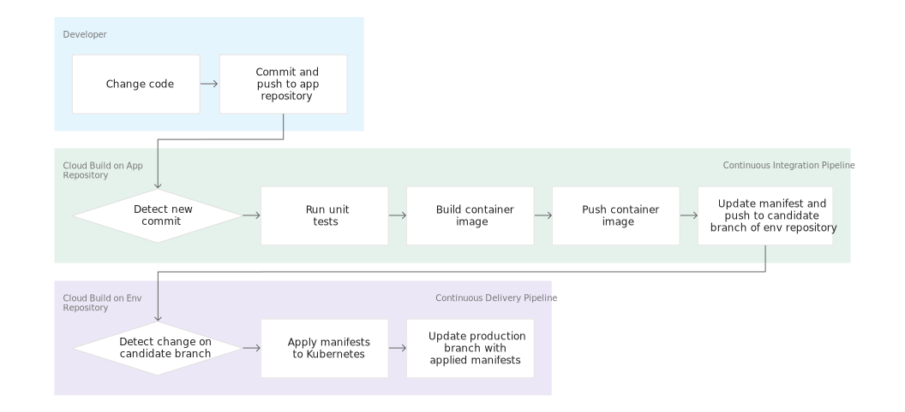
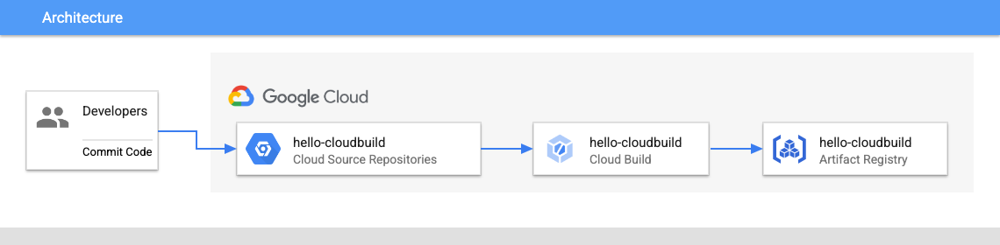
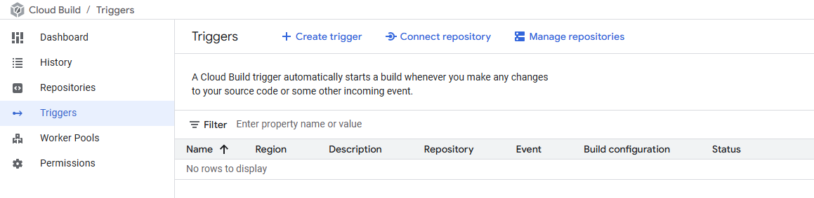
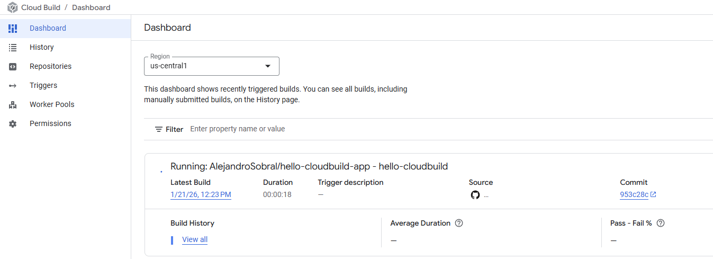
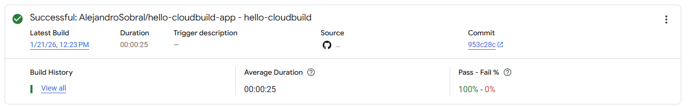
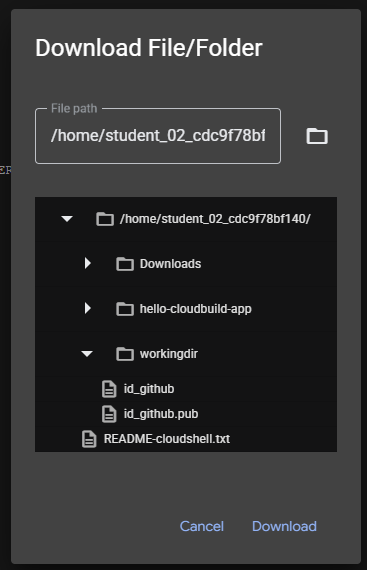
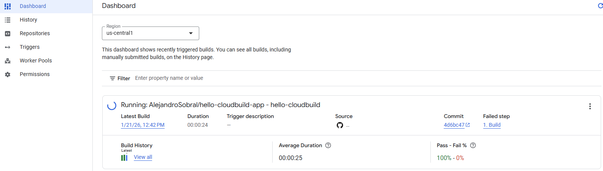
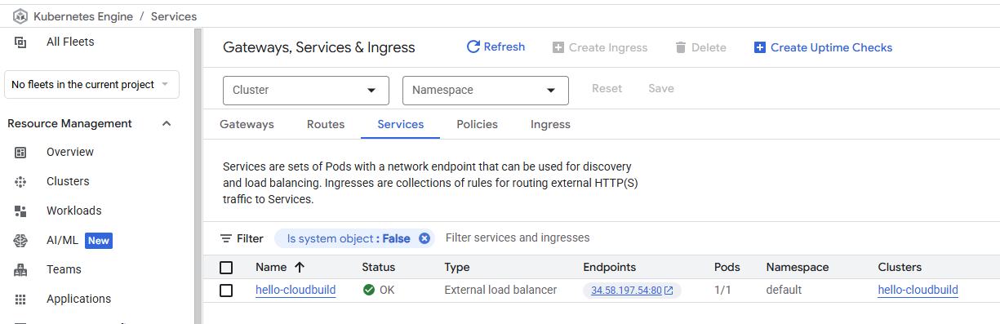
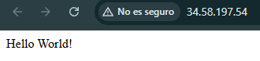

## Google Skills >> Implement DevOps Workflows in Google Cloud >> Google Kubernetes Engine Pipeline using Cloud Build

[Link](https://www.skills.google/focuses/52829?parent=catalog)

The main goal:

In this lab, you create a continuous integration and continuous deployment (CI/CD) pipeline that automatically builds a container image from committed code, stores the image in Artifact Registry, updates a Kubernetes manifest in a Git repository, and deploys the application to Google Kubernetes Engine using that manifest.

<div style="display: flex; justify-content: center;">
  <div style="margin: 0 10px;">
    
  </div>
</div>


Once the lab is completed, the whole picture will look like the following:

<div style="display: flex; justify-content: center;">
  <div style="margin: 0 10px;">
    
  </div>
</div>


## Task 1. Initialize your lab

- Import your project ID and project number as variables
- Enable the APIs for GKE, Cloud Build, Secret Manager, and Artifact Analysis
- Create an Artifact Registry Docker repository
- Create a GKE cluster to deploy the sample application of this lab

Set env variables:
```bash
# Set Env Variables
export PROJECT_ID=$(gcloud config get-value project)
export PROJECT_NUMBER=$(gcloud projects describe $PROJECT_ID --format='value(projectNumber)')
export REGION="us-central1"  ## To be defined once the lab starts


gcloud config set compute/region $REGION
```

Enable required APIs:
```bash
gcloud services enable container.googleapis.com \
    cloudbuild.googleapis.com \
    secretmanager.googleapis.com \
    containeranalysis.googleapis.com
```

Create the artifact Registry Docker repo:
```bash
gcloud artifacts repositories create my-repository \
  --repository-format=docker \
  --location=$REGION
```


Create the GKE cluster itself:

```bash
gcloud container clusters create hello-cloudbuild --num-nodes 1 --region $REGION
```

Set Git and GitHub in Cloud Shell:
```bash
curl -sS https://webi.sh/gh | sh 
gh auth login 
gh api user -q ".login"
GITHUB_USERNAME=$(gh api user -q ".login")
git config --global user.name "${GITHUB_USERNAME}"
git config --global user.email "${USER_EMAIL}"
echo ${GITHUB_USERNAME}
echo ${USER_EMAIL}
```


## Task 2. Create the Git repositories in GitHub repositories

Create the repos, and get the code from Cloud Storage
```bash
gh repo create  hello-cloudbuild-app --private 
gh repo create  hello-cloudbuild-env --private


# Get content from CS
cd ~
mkdir hello-cloudbuild-app
gcloud storage cp -r gs://spls/gsp1077/gke-gitops-tutorial-cloudbuild/* hello-cloudbuild-app

# Configure the Repo
cd ~/hello-cloudbuild-app
sed -i "s/us-central1/$REGION/g" cloudbuild.yaml
sed -i "s/us-central1/$REGION/g" cloudbuild-delivery.yaml
sed -i "s/us-central1/$REGION/g" cloudbuild-trigger-cd.yaml
sed -i "s/us-central1/$REGION/g" kubernetes.yaml.tpl

# Do the first commit
git init
git config credential.helper gcloud.sh
git remote add google https://github.com/${GITHUB_USERNAME}/hello-cloudbuild-app
git branch -m master
git add . && git commit -m "initial commit"
```

## Task 3. Create a container image with Cloud Build

Create a Cloud Build build based on the latest commit with the following command:

```bash
cd ~/hello-cloudbuild-app
COMMIT_ID="$(git rev-parse --short=7 HEAD)"
gcloud builds submit --tag="${REGION}-docker.pkg.dev/${PROJECT_ID}/my-repository/hello-cloudbuild:${COMMIT_ID}" .
```

&nbsp;

Verify the image is available in the Artifact Registry by browsing the web-page.


## Task 4. Create the Continuous Integration (CI) pipeline

Configure Cloud Build to automatically run a small unit test, build the container image, and then push it to Artifact Registry. Pushing a new commit to GitHub repositories triggers this pipeline automatically.


<div style="display: flex; justify-content: center;">
  <div style="margin: 0 10px;">
    
  </div>
</div>


The cloudbuild.yaml file, already included in the code, is the pipeline's configuration. To create the pipeline, follow the instructions below:

  - In the console title bar, enter **Cloud Build triggers** in the Search field, and then click Triggers, Cloud Build in the search results.

  - Click **Create Trigger**.
    - <div style="display: flex; justify-content: center;">
      <div style="margin: 0 10px;">
        
        </div>
      </div>

  - For Name, type **hello-cloudbuild**. Set Region.

  - Set Event to Push to a branch.

  - Under Source, for Repository, click Connect new repository.

    - a. Select GitHub (Cloud Build GitHub App). Click Continue.
    - b. Authenticate to your source repository with your username and password.
    - c. If you get the pop up "The GitHub App is not installed on any of your repositories", follow these steps:
      <details><summary>Install Google Cloud Build</summary>

      ```bash
        i. Click **Install Google Cloud Build**. Install the Cloud Build GitHub App in your personal account. Permit the installation using your GitHub account.

        ii. Under **Repository access**. Choose **Only select repositories**. Click the **Select the repositories** menu and select `${GITHUB_USERNAME}/hello-cloudbuild-app` and `${GITHUB_USERNAME}/hello-cloudbuild-env`.

        iii. Click **Install**.
      ```

      </detail>
    - d. Select ${GITHUB_USERNAME}/hello-cloudbuild-app for Repository. Click OK.

    - e. Accept I understand that GitHub content for the selected repositories....

    - f. Click Connect.
  - If the Cloud Build GitHub App is already installed in your account, you get the option to Edit Repositories on GitHub.

    - a. Under Repository access choose Only select repositories. Click the Select repositories menu and select the repository **$${GITHUB_USERNAME}/hello-cloudbuild-app** and **$${GITHUB_USERNAME}/hello-cloudbuild-env**.
    - b. Click Save.

  - On the Trigger page, from the Repository list, click ${GITHUB_USERNAME}/hello-cloudbuild-app.
  - For Branch type .* (any branch).
  - In the Configuration section, set Type to Cloud Build configuration file.
  - In the Location field, type cloudbuild.yaml after the /.
  - Set Service account to the Compute Engine default service account.
  - Click Create

When the trigger is created, return to the Cloud Shell. You now need to push the application code to GitHub repositories to trigger the CI pipeline in Cloud Build.

To start this trigger, run the following command:

```bash
cd ~/hello-cloudbuild-app
git add .
git commit -m "A nice commit message"
git push google master
```

Check the build running on the Dashboard. You can now proceed to examine the logs.

<div style="display: flex; justify-content: center;">
      <div style="margin: 0 10px;">
        
        </div>
      </div>


<div style="display: flex; justify-content: center;">
      <div style="margin: 0 10px;">
        
        </div>
      </div>


## Task 5. Accessing GitHub from a build via SSH keys

In this step use the Secret Manager with Cloud Build to access private GitHub repositories.

Create an ssh key:

```bash
cd ~
mkdir workingdir
cd workingdir
ssh-keygen -t rsa -b 4096 -N '' -f id_github -C ${USER_EMAIL}
```

In the Cloud Shell action bar, click More (More icon) and then Download > Toggle file browser and select the dropdown and workingdir folder to download the id_github file on your local machine.

<div style="display: flex; justify-content: center;">
      <div style="margin: 0 10px;">
        
        </div>
      </div>

Store the private SSH key in Secret Manager:

- In the console title bar, enter Secret Manager, and then click Secret Manager in the search results.
- Click Create Secret.
- Set Name to ssh_key_secret.
- Set Secret value to Upload and upload your id_github file.
- Leave other settings at their defaults.
- Click Create secret.

> This uploads your id_github file to Secret Manager.


Add the public SSH key to your private repository's deploy keys:

- Login to your personal GitHub account
- In the top right corner, click your profile photo, then click Your profile.
- On your profile page, click Repositories, then click the hello-cloudbuild-env repository.
- From your repository, click Settings.
- In the left pane, click Deploy Keys, then click Add deploy key.
- Provide the title SSH_KEY, paste your public SSH key from workingdir/id_github.pub from Cloud Shell.
- Select Allow write access so this key has write access to the repository. A deploy key with write access lets a deployment push to the repository.
- Click Add key.
- Delete the SSH key from your disk.

Grant the service account permission to access Secret Manager:

```bash
gcloud projects add-iam-policy-binding ${PROJECT_NUMBER} \
--member=serviceAccount:${PROJECT_NUMBER}-compute@developer.gserviceaccount.com \
--role=roles/secretmanager.secretAccessor
```

## Task 6. Create the test environment and CD pipeline

To deploy the application in your Kubernetes cluster, Cloud Build needs the Kubernetes Engine Developer Identity and the Access Management role.


Grant Cloud Build access to GKE:

```bash
cd ~
PROJECT_NUMBER="$(gcloud projects describe ${PROJECT_ID} --format='get(projectNumber)')"

gcloud projects add-iam-policy-binding ${PROJECT_NUMBER} \
--member=serviceAccount:${PROJECT_NUMBER}@cloudbuild.gserviceaccount.com \
--role=roles/container.developer
```

You need to initialize the hello-cloudbuild-env repository with two branches (production and candidate) and a Cloud Build configuration file describing the deployment process.

The first step is to clone the hello-cloudbuild-env repository and create the production branch, which is still empty.

```bash
mkdir hello-cloudbuild-env
gcloud storage cp -r gs://spls/gsp1077/gke-gitops-tutorial-cloudbuild/* hello-cloudbuild-env

cd hello-cloudbuild-env
sed -i "s/us-central1/$REGION/g" cloudbuild.yaml
sed -i "s/us-central1/$REGION/g" cloudbuild-delivery.yaml
sed -i "s/us-central1/$REGION/g" cloudbuild-trigger-cd.yaml
sed -i "s/us-central1/$REGION/g" kubernetes.yaml.tpl
```

For Cloud Build to connect to GitHub, you must add the public SSH key to the known_hosts file in Cloud Build's build environment. In your hello-cloudbuild-env directory, create a file named known_hosts.github, add the public SSH key to this file, and provide the necessary permission to the file:

```bash
cd ~/hello-cloudbuild-env
ssh-keyscan -t rsa github.com > known_hosts.github
chmod +x known_hosts.github
```

```bash
git init
git config credential.helper gcloud.sh
git remote add google https://github.com/${GITHUB_USERNAME}/hello-cloudbuild-env
git branch -m master
git add . && git commit -m "initial commit"
git push google master

cd ~/hello-cloudbuild-env
git checkout -b production
```


Replace the cloudbuild.yaml in the hello-cloudbuild-env.yaml repository with the file content in this very same repo named cloudbuild-env.yaml. 
Replace {GITHUB-USERNAME} (L34) with your personal GitHub username:


```bash
cd ~/hello-cloudbuild-env
git add .
git commit -m "Create cloudbuild.yaml for deployment"
```

The cloudbuild.yaml file describes the deployment process to be run in Cloud Build. 

It has two steps:

- Cloud Build applies the manifest to the GKE cluster.
- If successful, Cloud Build copies the manifest on the production branch.


Create a candidate branch and push both branches for them to be available in GitHub Repositories:

**DO THIS IN BOTH REPOS!**
```bash
git checkout -b candidate
git push google production
git push google candidate
```


- Create the trigger for the continuous delivery pipeline:
- In the console title bar, enter Cloud Build Triggers, and then click Triggers, Cloud Build.
- Click Create Trigger.
- Set Name to hello-cloudbuild-deploy. Set Region.
- Under Event, select Push to a branch.
- Under Source, for Repository click Connect new repository.
  - a. Select GitHub (Cloud Build GitHub App). Click Continue.
  - b. Authenticate to your source repository with your GitHub username and password.
  - c. Select ${GITHUB_USERNAME}/hello-cloudbuild-env repository. Click OK.
  - d. Select I understand that GitHub content for the selected repositories..
  - e. Click Connect.

- Under Repository select ${GITHUB_USERNAME}/hello-cloudbuild-env.
- Under Source, select ^candidate$ as your Branch.
- Under Build configuration, select Cloud Build configuration file.
- In the Cloud Build configuration file location field, type cloudbuild.yaml after the /.
- Set Service account to the Compute Engine default service account.
- Click Create.
- In your hello-cloudbuild-app directory, create a file named known_hosts.github, add the public SSH key to this file and provide the necessary permission to the file:

```bash
cd ~/hello-cloudbuild-app
ssh-keyscan -t rsa github.com > known_hosts.github
chmod +x known_hosts.github

git add .
git commit -m "Adding known_host file."
git push google master
```


Modify the continuous integration pipeline to trigger the continuous delivery pipeline:

```bash
cd ~/hello-cloudbuild-app
```

Replace the cloudbuild.yaml in the hello-cloudbuild-app repository with the content of the file named cloudbuild-app.yaml.
Replace ${GITHUB-USERNAME} with your GitHub username.


```bash
git add cloudbuild.yaml
git commit -m "Trigger CD pipeline"
git push google master
```

<div style="display: flex; justify-content: center;">
      <div style="margin: 0 10px;">
        
        </div>
      </div>

## Task 7. Review Cloud Build pipeline

In this task, you review the Cloud Build pipeline in the console.


- In the console, still in the Cloud Build page, click Dashboard in the left pane.
- Click the hello-cloudbuild-app trigger to follow its execution and examine its logs. The last step of this pipeline pushes the new manifest to the hello-cloudbuild-env repository, which triggers the continuous delivery pipeline.
- Return to the main Dashboard.
- You should see a build either running or recently finished for the hello-cloudbuild-env repository.

## Task 8. Test the complete pipeline

You've now configured the complete CI/CD pipeline. In this task you perform an end to end test.

- In the console, in the Navigation menu (Navigation menu icon), click Kubernetes Engine > Gateways, Services & Ingress > Services.

There should be a single service called hello-cloudbuild in the list. It has been created by the continuous delivery build that just ran.

- Click on the endpoint for the hello-cloudbuild service. You should see "Hello World!". If there is no endpoint, or if you see a load balancer error, you may have to wait a few minutes for the load balancer to completely initialize. If needed, click Refresh to update the page.

- In Cloud Shell, replace "Hello World" with "Hello Cloud Build", both in the application and in the unit test:

```bash

## Modify the app
cd ~/hello-cloudbuild-app
sed -i 's/Hello World/Hello Cloud Build/g' app.py
sed -i 's/Hello World/Hello Cloud Build/g' test_app.py

## Commit and push
git add app.py test_app.py
git commit -m "Hello Cloud Build"
git push google master
```

> This triggers the full CI/CD pipeline.

After a few minutes, reload the application in your browser. You should now see "Hello Cloud Build!".

<div style="display: flex; justify-content: center;">
      <div style="margin: 0 10px;">
        
        </div>
      </div>

&nbsp;

<div style="display: flex; justify-content: center;">
      <div style="margin: 0 10px;">
        
        </div>
      </div>


## Task 9. Test the rollback

In this task, you rollback to the version of the application that said "Hello World!".


- In the console title bar, type Cloud Build Dashboard in the Search field, and then click Cloud Build in the search results. Be sure Dashboard is selected in the left pane.
- Click the View all link under Build History for the hello-cloudbuild-env repository.
- Click on the second most recent build available.
- Click Rebuild.

<div style="display: flex; justify-content: center;">
      <div style="margin: 0 10px;">
        
        </div>
      </div>


<h2> Congratulations! </h2>