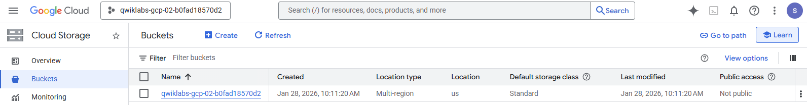
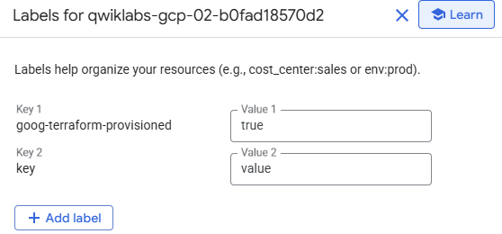

### 4. Manage Terraform State

[Link](https://www.skills.google/course_templates/636/labs/592699)


Objectives
In this lab, you learn how to perform the following tasks:

- Create a local backend.
- Create a Cloud Storage backend.
- Refresh your Terraform state.
- Import a Terraform configuration.
- Manage the imported configuration with Terraform

----------------------------------------------------------


### Purpose of Terraform state
State is a necessary requirement for Terraform to function. People sometimes ask whether Terraform can work without state or not use state and just inspect cloud resources on every run. In the scenarios where Terraform may be able to get away without state, doing so would require shifting massive amounts of complexity from one place (state) to another place (the replacement concept). This section explains why Terraform state is required.

### Mapping to the real world
Terraform requires some sort of database to map Terraform config to the real world. When your configuration contains a resource resource "google_compute_instance" "foo", Terraform uses this map to know that instance i-abcd1234 is represented by that resource.

Terraform expects that each remote object is bound to only one resource instance, which is normally guaranteed because Terraform is responsible for creating the objects and recording their identities in the state. If you instead import objects that were created outside of Terraform, you must verify that each distinct object is imported to only one resource instance.

If one remote object is bound to two or more resource instances, Terraform may take unexpected actions against those objects because the mapping from configuration to the remote object state has become ambiguous.


### Metadata
In addition to tracking the mappings between resources and remote objects, Terraform must also track metadata such as resource dependencies.

Terraform typically uses the configuration to determine dependency order. However, when you remove a resource from a Terraform configuration, Terraform must know how to delete that resource. Terraform can see that a mapping exists for a resource that is not in your configuration file and plan to destroy. However, because the resource no longer exists, the order cannot be determined from the configuration alone.

To ensure correct operation, Terraform retains a copy of the most recent set of dependencies within the state. Now Terraform can still determine the correct order for destruction from the state when you delete one or more items from the configuration.


### Performance
In addition to basic mapping, Terraform stores a cache of the attribute values for all resources in the state. This is an optional feature of Terraform state and is used only as a performance improvement.

When running a terraform plan, Terraform must know the current state of resources in order to effectively determine the changes needed to reach your desired configuration.

For small infrastructures, Terraform can query your providers and sync the latest attributes from all your resources. This is the default behavior of Terraform: for every plan and apply, Terraform syncs all resources in your state.

For larger infrastructures, querying every resource is too slow. Many cloud providers do not provide APIs to query multiple resources at the same time, and the round trip time for each resource is hundreds of milliseconds. In addition, cloud providers almost always have API rate limiting, so Terraform can only request a limited number of resources in a period of time. Larger users of Terraform frequently use both the -refresh=false flag and the -target flag in order to work around this. In these scenarios, the cached state is treated as the record of truth.

### Synchronization
In the default configuration, Terraform stores the state in a file in the current working directory where Terraform was run. This works when you are getting started, but when Terraform is used in a team, it is important for everyone to be working with the same state so that operations will be applied to the same remote objects.

Remote state is the recommended solution to this problem. With a fully featured state backend, Terraform can use remote locking as a measure to avoid multiple different users accidentally running Terraform at the same time; this ensures that each Terraform run begins with the most recent updated state.

### State locking
If supported by your backend, Terraform will lock your state for all operations that could write state. This prevents others from acquiring the lock and potentially corrupting your state.

### Workspaces
Each Terraform configuration has an associated backend that defines how operations are executed and where persistent data such as the Terraform state is stored.

The persistent data stored in the backend belongs to a workspace. Initially the backend has only one workspace, called default, and thus only one Terraform state is associated with that configuration.

Certain backends support multiple named workspaces, which allows multiple states to be associated with a single configuration. The configuration still has only one backend, but multiple distinct instances of that configuration can be deployed without configuring a new backend or changing authentication credentials.


## Guide:

### Task 1. Work with backends

Add a local backend
In this section, you explore how to configure a local backend.

When configuring a backend for the first time (moving from no defined backend to explicitly configuring one), Terraform gives you the option to migrate your state to the new backend. This lets you adopt backends without losing any existing state.

To be extra careful, it is always recommended that you also manually back up your state. You can do this by simply copying your terraform.tfstate file to another location. The initialization process should also create a backup, but it never hurts to be safe!

Configuring a backend for the first time is no different from changing a configuration in the future: create the new configuration and run terraform init.


Check the 0_main.tf:
```bash
...
..
.
terraform {
  backend "local" {
    path = "terraform/state/terraform.tfstate"
  }
}
...
..
.
```

This references a terraform.tfstate file in the terraform/state directory. To specify a different file path, change the path variable.


Init the backend and apply by doing:

```bash
terraform plan
terraform apply
```

&nbsp;


Now look for the status file located at terraform/state, or execute the following:
```bash
terraform show


# google_storage_bucket.test-bucket-for-state:
resource "google_storage_bucket" "test-bucket-for-state" {
    default_event_based_hold    = false
    effective_labels            = {
        "goog-terraform-provisioned" = "true"
    }
    enable_object_retention     = false
    force_destroy               = false
    id                          = "qwiklabs-gcp-02-b0fad18570d2"
    location                    = "US"
    name                        = "qwiklabs-gcp-02-b0fad18570d2"
    project                     = "qwiklabs-gcp-02-b0fad18570d2"
    project_number              = 35147967085
    public_access_prevention    = "inherited"
    requester_pays              = false
    rpo                         = "DEFAULT"
    self_link                   = "https://www.googleapis.com/storage/v1/b/qwiklabs-gcp-02-b0fad18570d2"
    storage_class               = "STANDARD"
    terraform_labels            = {
        "goog-terraform-provisioned" = "true"
    }
    time_created                = "2026-01-28T13:11:20.113Z"
    uniform_bucket_level_access = true
    updated                     = "2026-01-28T13:11:20.113Z"
    url                         = "gs://qwiklabs-gcp-02-b0fad18570d2"

    hierarchical_namespace {
        enabled = false
    }

    soft_delete_policy {
        effective_time             = "2026-01-28T13:11:20.113Z"
        retention_duration_seconds = 604800
    }
}

```


Navigate to main.tf and replace the tfstate file as the following, (1_main.tf)

```bash
terraform {
  backend "gcs" {
    bucket  = "qwiklabs-gcp-02-b0fad18570d2"
    prefix  = "terraform/state"
  }
}
```

This will add a Add a Cloud Storage backend. Now *migrate* the state to gcs:


```bash
terraform init -migrate-state
```

The Storage is created:




### Refresh the state
The terraform refresh command is used to reconcile the state Terraform knows about (via its state file) with the real-world infrastructure. This can be used to detect any drift from the last-known state and to update the state file.
This does not modify infrastructure, but does modify the state file. If the state is changed, this may cause changes to occur during the next plan or apply.

So to fully understand how this works, manually modify the labels of the Storage:



The "key" = "value" key-value pair should be displayed in the labels attribute of the configuration.

```bash
$ t refresh
google_storage_bucket.test-bucket-for-state: Refreshing state... [id=qwiklabs-gcp-02-b086906b1f52]


$ t show
# google_storage_bucket.test-bucket-for-state:
resource "google_storage_bucket" "test-bucket-for-state" {
    default_event_based_hold    = false
    effective_labels            = {
        "goog-terraform-provisioned" = "true"
        "key"                        = "value"
    }
    enable_object_retention     = false
    force_destroy               = false
    id                          = "qwiklabs-gcp-02-b086906b1f52"
    labels                      = {}
    location                    = "US"
    name                        = "qwiklabs-gcp-02-b086906b1f52"
    project                     = "qwiklabs-gcp-02-b086906b1f52"
    project_number              = 720400871063
    public_access_prevention    = "inherited"
    requester_pays              = false
    rpo                         = "DEFAULT"
    self_link                   = "https://www.googleapis.com/storage/v1/b/qwiklabs-gcp-02-b086906b1f52"
    storage_class               = "STANDARD"
    terraform_labels            = {
        "goog-terraform-provisioned" = "true"
    }
    time_created                = "2026-01-28T13:24:28.032Z"
    uniform_bucket_level_access = true
    updated                     = "2026-01-28T13:26:24.030Z"
    url                         = "gs://qwiklabs-gcp-02-b086906b1f52"

    hierarchical_namespace {
        enabled = false
    }

    soft_delete_policy {
        effective_time             = "2026-01-28T13:24:28.032Z"
        retention_duration_seconds = 604800
    }
}
```

### Importing existing Infra
You may need to manage infrastructure that wasn’t created by Terraform. Terraform import solves this problem by loading supported resources into your Terraform workspace’s state.

- Identify the existing infrastructure to be imported.
- Import the infrastructure into your Terraform state.
- Write a Terraform configuration that matches that infrastructure.
- Review the Terraform plan to ensure that the configuration matches the expected state and infrastructure.
- Apply the configuration to update your Terraform state.


In this section, first you will create a Docker container with the Docker CLI. Next, you will import it into a new Terraform workspace. Then you will update the container’s configuration using Terraform before finally destroying it when you are done.


Run the container:
```bash
docker run --name hashicorp-learn --detach --publish 8080:80 nginx:latest
```

Import the container into Terraform:
```bash
git clone https://github.com/hashicorp/learn-terraform-import.git
```

Update the provider version in the terraform.tf file:
```bash
cd learn-terraform-import
sed -i 's/version = "~> 3.0.2"/version = ">= 3.5"/' terraform.tf
```

Run the following command to initialize your Terraform workspace:
```bash
terraform init --upgrade
```

Import the existing config:
```bash
## Manual version using the Container ID
terraform import docker_container.web 6fbe5efbc2814ca741a741de75ab7950f8c288fac898f6ab32fed631fdffd0b3

## The automatic version:
terraform import docker_container.web $(docker inspect -f {{.ID}} hashicorp-learn)
```

Verify by running terraform show.

```bash
terraform show

# docker_container.web:
resource "docker_container" "web" {
    command           = [
        "nginx",
        "-g",
        "daemon off;",
    ]
    cpu_shares        = 0
    dns               = []
    dns_opts          = []
    dns_search        = []
    entrypoint        = [
        "/docker-entrypoint.sh",
    ]
    group_add         = []
    hostname          = "6fbe5efbc281"
    id                = "6fbe5efbc2814ca741a741de75ab7950f8c288fac898f6ab32fed631fdffd0b3"
    image             = "nginx:latest"
    init              = false
    ipc_mode          = "private"
    log_driver        = "json-file"
    log_opts          = {}
    max_retry_count   = 0
    memory            = 0
    memory_swap       = 0
    name              = "hashicorp-learn"
    network_data      = [
        {
            gateway                   = "172.17.0.1"
            global_ipv6_address       = ""
            global_ipv6_prefix_length = 0
            ip_address                = "172.17.0.2"
            ip_prefix_length          = 16
            ipv6_gateway              = ""
            mac_address               = "9a:33:1c:12:e1:83"
            network_name              = "bridge"
        },
    ]
    network_mode      = "bridge"
    privileged        = false
    publish_all_ports = false
    read_only         = false
    restart           = "no"
    rm                = false
    runtime           = "runc"
    security_opts     = []
    shm_size          = 64
    stdin_open        = false
    stop_signal       = "SIGQUIT"
    stop_timeout      = 0
    storage_opts      = {}
    sysctls           = {}
    tmpfs             = {}
    tty               = false

    ports {
        external = 8080
        internal = 80
        ip       = "0.0.0.0"
        protocol = "tcp"
    }
}

```


This state contains everything that Terraform knows about the Docker container you just imported. However, Terraform import does not create the configuration for the resource.

Create the configuration
You’ll need to create the Terraform configuration before you can use Terraform to manage this container.