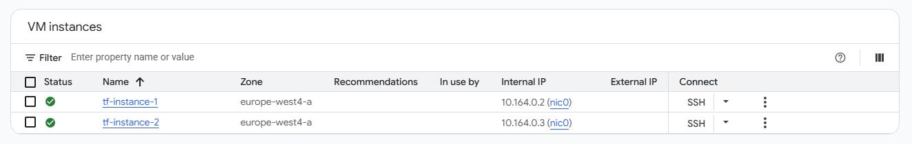

### Build Infrastructure with Terraform on Google Cloud: Challenge Lab

[Link](https://www.skills.google/course_templates/636/labs/592700)

[Badge](https://www.credly.com/badges/d9d08540-6050-4f9e-8195-427d6623738b/public_url)


Topics tested:
- Import existing infrastructure into your Terraform configuration.
- Build and reference your own Terraform modules.
- Add a remote backend to your configuration.
- Use and implement a module from the Terraform Registry.
- Re-provision, destroy, and update infrastructure.
- Test connectivity between the resources you've created.


###

To have it handy:

terraform import docker_container.web $(docker inspect -f {{.ID}} hashicorp-learn)
terraform show -no-color > docker.tf


## Task 1: Create the configuration files

Create the following structure whether manually of with the following bash script:

```
main.tf
variables.tf
modules/
└── instances
    ├── instances.tf
    ├── outputs.tf
    └── variables.tf
└── storage
    ├── storage.tf
    ├── outputs.tf
    └── variables.tf
```

```bash
#!/bin/bash

## Add useful aliases
alias c=clear
alias t=terraform

# Create the root files
touch main.tf variables.tf

# Create the instances module directory and files
mkdir -p modules/instances
touch modules/instances/{instances.tf,outputs.tf,variables.tf}

# Create the storage module directory and files
mkdir -p modules/storage
touch modules/storage/{storage.tf,outputs.tf,variables.tf}

echo "Terraform directory structure created successfully!"
```

Fill in the region, zone and project_id variable files.

Set main & variables files as it has been done in Task1. 


## Task 2. Import infrastructure

Navigate to Compute Engine > VM Instances. 



Copy the ID of both instances and have it handy. Or get it from the CLI:

```bash
export ZONE=us-west4-b

gcloud compute instances describe tf-instance-1     --zone=$ZONE     --format='get(id)'
4719813987852022754

$ gcloud compute instances describe tf-instance-2     --zone=$ZONE     --format='get(id)'
4514524412348134370
```


First, add the module reference into the main.tf file then re-initialize Terraform. (Check main.tf in Task2).

Include in the main.tf
```bash
module "instances" {
  source     = "./modules/instances"
}
```

```bash
Terraform init
```

Execute terraform init. Check the import of the module.
```bash
Initializing the backend...
Initializing modules...
- instances in modules/instances
```


Add the content of intances.tf accordingly to instances.tf.

Then proceed to import the instances as below:

```bash
terraform import module.instances.google_compute_instance.tf-instance-1 <INSTANCE-ID>

terraform import module.instances.google_compute_instance.tf-instance-1 4719813987852022754
module.instances.google_compute_instance.tf-instance-1: Importing from ID "4719813987852022754"...
module.instances.google_compute_instance.tf-instance-1: Import prepared!
  Prepared google_compute_instance for import
module.instances.google_compute_instance.tf-instance-1: Refreshing state... [id=projects/qwiklabs-gcp-00-27d9523a2917/zones/europe-west4-a/instances/389794437252183804]
Import successful!
```

```bash
terraform import module.instances.google_compute_instance.tf-instance-2 <INSTANCE-ID-2>

terraform import module.instances.google_compute_instance.tf-instance-2 4514524412348134370
module.instances.google_compute_instance.tf-instance-2: Importing from ID "6498165176948684540"...
module.instances.google_compute_instance.tf-instance-2: Import prepared!
  Prepared google_compute_instance for import
module.instances.google_compute_instance.tf-instance-2: Refreshing state... [id=projects/qwiklabs-gcp-00-27d9523a2917/zones/europe-west4-a/instances/6498165176948684540]

Import successful!
```

The two instances have now been imported into your terraform modules. You can now optionally run the commands to update the state of Terraform. Type yes at the dialogue after you run the apply command to accept the state changes.


The plan says it only would update one flag.
```bash
terraform plan


t plan
module.instances.google_compute_instance.tf-instance-1: Refreshing state... [id=projects/qwiklabs-gcp-00-27d9523a2917/zones/europe-west4-a/instances/tf-instance-1]
module.instances.google_compute_instance.tf-instance-2: Refreshing state... [id=projects/qwiklabs-gcp-00-27d9523a2917/zones/europe-west4-a/instances/tf-instance-2]

Terraform used the selected providers to generate the following execution plan. Resource actions are indicated with the following symbols:
  ~ update in-place

Terraform will perform the following actions:

  # module.instances.google_compute_instance.tf-instance-1 will be updated in-place
  ~ resource "google_compute_instance" "tf-instance-1" {
      + allow_stopping_for_update = true
        id                        = "projects/qwiklabs-gcp-00-27d9523a2917/zones/europe-west4-a/instances/tf-instance-1"
        name                      = "tf-instance-1"
        tags                      = []
        # (18 unchanged attributes hidden)

      - timeouts {}

        # (4 unchanged blocks hidden)
    }

  # module.instances.google_compute_instance.tf-instance-2 will be updated in-place
  ~ resource "google_compute_instance" "tf-instance-2" {
      + allow_stopping_for_update = true
        id                        = "projects/qwiklabs-gcp-00-27d9523a2917/zones/europe-west4-a/instances/tf-instance-2"
        name                      = "tf-instance-2"
        tags                      = []
        # (18 unchanged attributes hidden)

      - timeouts {}

        # (4 unchanged blocks hidden)
    }

Plan: 0 to add, 2 to change, 0 to destroy.

terraform apply
```

## Task 3. Configure a remote backend

Create the Cloud Storage inside the storage module, add the reference in main and apply.
Configure the remote storage in the main.
Re-initiate terraform.


## Task 4. Modify and update infrastructure

Navigate to the instances module and modify the tf-instance-1 resource to use an e2-standard-2 machine type.
Modify the tf-instance-2 resource to use an e2-standard-2 machine type.

Add a third instance resource and name it Instance Name. For this third resource, use an e2-standard-2 machine type. Make sure to change the machine type to e2-standard-2 to all the three instances.
Then, do terraform apply.

## Task 5. Destroy resources

Remove the third instance and do apply once again.

## Task 6. Use the Terraform Registry.

Browse to the registry, pick a vpc and modify the given parameters.

## Task 7. Include a firewall.

Add a firewall to the network. Type is: google_compute_firewall


