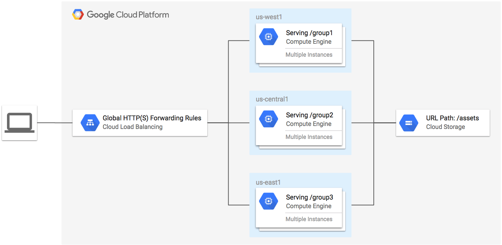
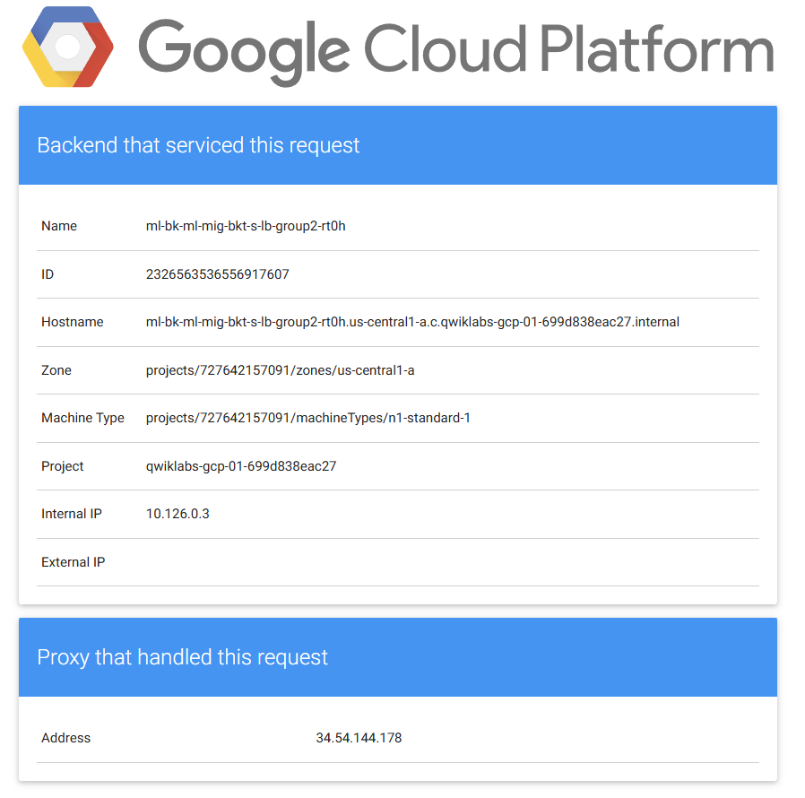

## 2. HTTPS Content-Based Load Balancer with Terraform

[Link](https://www.skills.google/course_templates/746/labs/557771)

------------------------------

### Objective:

In this lab, you create an HTTPS load balancer to forward traffic to a custom URL map. The URL map sends traffic to the region closest to you with static assets being served from a Cloud Storage bucket. The TLS key and certificate is generated by Terraform using the TLS provider.

  

    
  

&nbsp;

Follow the instructions on the following repo:

[Github Resource](https://github.com/terraform-google-modules/terraform-google-lb-http/tree/main/examples/multi-backend-multi-mig-bucket-https-lb)

The final output will be:

  

    
  

