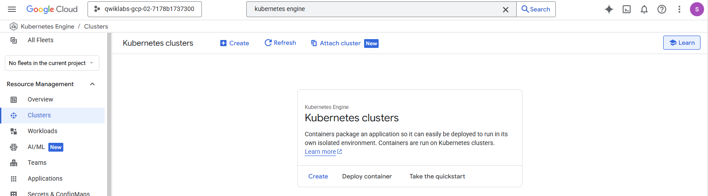
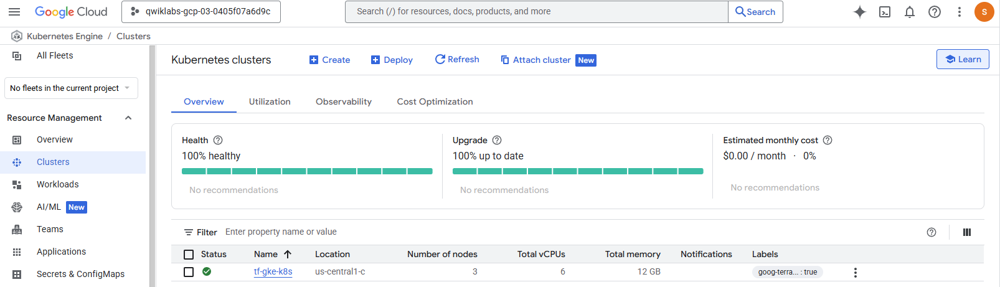

## Deploy Kubernetes Load Balancer Service with Terraform

[Link](https://www.skills.google/course_templates/746?catalog_rank=%7B%22rank%22%3A8%2C%22num_filters%22%3A0%2C%22has_search%22%3Atrue%7D&search_id=69447657)

[My readme]


------------------------------

### Objective:

In Terraform, a Provider is the logical abstraction of an upstream API. This lab will show you how to set up a Kubernetes cluster and deploy Load Balancer type NGINX service on it.

&nbsp;

------------------------------
### Step-by-step-guide

Clone the files
```bash
gsutil -m cp -r gs://spls/gsp233/* .
```

&nbsp;

Change directory:
```bash
cd tf-gke-k8s-service-lb
```

&nbsp;

Inspect the content of main.tf and k8s.tf

```bash
cat main.tf
cat k8s.tf
```

&nbsp;

Initialize Terraform by executing:
```bash
terraform init


Initializing the backend...

Initializing provider plugins...
- Finding hashicorp/kubernetes versions matching "~> 1.10.0"...
- Finding latest version of hashicorp/google...
- Installing hashicorp/kubernetes v1.10.0...
- Installed hashicorp/kubernetes v1.10.0 (signed by HashiCorp)
- Installing hashicorp/google v7.16.0...
- Installed hashicorp/google v7.16.0 (signed by HashiCorp)

Terraform has created a lock file .terraform.lock.hcl to record the provider
selections it made above. Include this file in your version control repository
so that Terraform can guarantee to make the same selections by default when
you run "terraform init" in the future.

╷
│ Warning: Version constraints inside provider configuration blocks are deprecated
│ 
│   on k8s.tf line 2, in provider "kubernetes":
│    2:   version = "~> 1.10.0"
│ 
│ Terraform 0.13 and earlier allowed provider version constraints inside the provider configuration block, but that is now deprecated and will be removed in a future version of Terraform. To silence this warning, move the provider version
│ constraint into the required_providers block.
│ 
│ (and one more similar warning elsewhere)
╵

Terraform has been successfully initialized!

You may now begin working with Terraform. Try running "terraform plan" to see
any changes that are required for your infrastructure. All Terraform commands
should now work.

If you ever set or change modules or backend configuration for Terraform,
rerun this command to reinitialize your working directory. If you forget, other
commands will detect it and remind you to do so if necessary.
```

&nbsp;

So far, following command will prompt no result. Resources does not exist yet:
```bash
gcloud container clusters list
```

<div style="display: flex; justify-content: center;">
  <div style="margin: 0 10px;">
    
  </div>
</div>

&nbsp;


Verify the plan to be applied:

```bash
terraform plan -var="region=us-central1" -var="location=us-central1-c"
```

<details><summary>Terraform plan output </summary>

```bash
data.google_client_config.current: Reading...
data.google_client_config.current: Read complete after 1s [id=projects/qwiklabs-gcp-03-0405f07a6d9c/regions/us-central1/zones/]
data.google_container_engine_versions.default: Reading...
data.google_container_engine_versions.default: Read complete after 0s [id=2026-01-26 14:26:11.807396079 +0000 UTC]

Terraform used the selected providers to generate the following execution plan. Resource actions are indicated with the following symbols:
  + create

Terraform will perform the following actions:

  # google_compute_address.default will be created
  + resource "google_compute_address" "default" {
      + address            = (known after apply)
      + address_type       = "EXTERNAL"
      + creation_timestamp = (known after apply)
      + effective_labels   = {
          + "goog-terraform-provisioned" = "true"
        }
      + id                 = (known after apply)
      + label_fingerprint  = (known after apply)
      + name               = "tf-gke-k8s"
      + network_tier       = (known after apply)
      + prefix_length      = (known after apply)
      + project            = "qwiklabs-gcp-03-0405f07a6d9c"
      + purpose            = (known after apply)
      + region             = "us-central1"
      + self_link          = (known after apply)
      + subnetwork         = (known after apply)
      + terraform_labels   = {
          + "goog-terraform-provisioned" = "true"
        }
      + users              = (known after apply)
    }

  # google_compute_network.default will be created
  + resource "google_compute_network" "default" {
      + auto_create_subnetworks                   = false
      + bgp_always_compare_med                    = (known after apply)
      + bgp_best_path_selection_mode              = (known after apply)
      + bgp_inter_region_cost                     = (known after apply)
      + delete_bgp_always_compare_med             = false
      + delete_default_routes_on_create           = false
      + gateway_ipv4                              = (known after apply)
      + id                                        = (known after apply)
      + internal_ipv6_range                       = (known after apply)
      + mtu                                       = (known after apply)
      + name                                      = "tf-gke-k8s"
      + network_firewall_policy_enforcement_order = "AFTER_CLASSIC_FIREWALL"
      + network_id                                = (known after apply)
      + numeric_id                                = (known after apply)
      + project                                   = "qwiklabs-gcp-03-0405f07a6d9c"
      + routing_mode                              = (known after apply)
      + self_link                                 = (known after apply)
    }

  # google_compute_subnetwork.default will be created
  + resource "google_compute_subnetwork" "default" {
      + creation_timestamp         = (known after apply)
      + external_ipv6_prefix       = (known after apply)
      + fingerprint                = (known after apply)
      + gateway_address            = (known after apply)
      + id                         = (known after apply)
      + internal_ipv6_prefix       = (known after apply)
      + ip_cidr_range              = "10.127.0.0/20"
      + ipv6_cidr_range            = (known after apply)
      + ipv6_gce_endpoint          = (known after apply)
      + name                       = "tf-gke-k8s"
      + network                    = (known after apply)
      + private_ip_google_access   = true
      + private_ipv6_google_access = (known after apply)
      + project                    = "qwiklabs-gcp-03-0405f07a6d9c"
      + purpose                    = (known after apply)
      + region                     = "us-central1"
      + self_link                  = (known after apply)
      + stack_type                 = (known after apply)
      + state                      = (known after apply)
      + subnetwork_id              = (known after apply)
    }

  # google_container_cluster.default will be created
  + resource "google_container_cluster" "default" {
      + cluster_ipv4_cidr                        = (known after apply)
      + datapath_provider                        = (known after apply)
      + default_max_pods_per_node                = (known after apply)
      + deletion_protection                      = true
      + disable_l4_lb_firewall_reconciliation    = false
      + effective_labels                         = {
          + "goog-terraform-provisioned" = "true"
        }
      + enable_cilium_clusterwide_network_policy = false
      + enable_fqdn_network_policy               = false
      + enable_intranode_visibility              = (known after apply)
      + enable_kubernetes_alpha                  = false
      + enable_l4_ilb_subsetting                 = (known after apply)
      + enable_legacy_abac                       = true
      + enable_multi_networking                  = false
      + enable_shielded_nodes                    = true
      + endpoint                                 = (known after apply)
      + id                                       = (known after apply)
      + initial_node_count                       = 3
      + label_fingerprint                        = (known after apply)
      + location                                 = "us-central1-c"
      + logging_service                          = (known after apply)
      + master_version                           = (known after apply)
      + min_master_version                       = "1.34.3-gke.1136000"
      + monitoring_service                       = (known after apply)
      + name                                     = "tf-gke-k8s"
      + network                                  = "tf-gke-k8s"
      + networking_mode                          = (known after apply)
      + node_locations                           = (known after apply)
      + node_version                             = (known after apply)
      + operation                                = (known after apply)
      + private_ipv6_google_access               = (known after apply)
      + project                                  = (known after apply)
      + self_link                                = (known after apply)
      + services_ipv4_cidr                       = (known after apply)
      + subnetwork                               = "tf-gke-k8s"
      + terraform_labels                         = {
          + "goog-terraform-provisioned" = "true"
        }
      + tpu_ipv4_cidr_block                      = (known after apply)
    }

  # kubernetes_namespace.staging will be created
  + resource "kubernetes_namespace" "staging" {
      + id = (known after apply)

      + metadata {
          + generation       = (known after apply)
          + name             = "staging"
          + resource_version = (known after apply)
          + self_link        = (known after apply)
          + uid              = (known after apply)
        }
    }

  # kubernetes_replication_controller.nginx will be created
  + resource "kubernetes_replication_controller" "nginx" {
      + id = (known after apply)

      + metadata {
          + generation       = (known after apply)
          + labels           = {
              + "run" = "nginx"
            }
          + name             = "nginx"
          + namespace        = "staging"
          + resource_version = (known after apply)
          + self_link        = (known after apply)
          + uid              = (known after apply)
        }

      + spec {
          + min_ready_seconds = 0
          + replicas          = 1
          + selector          = {
              + "run" = "nginx"
            }

          + template {
              + active_deadline_seconds          = (known after apply)
              + dns_policy                       = (known after apply)
              + host_ipc                         = (known after apply)
              + host_network                     = (known after apply)
              + host_pid                         = (known after apply)
              + hostname                         = (known after apply)
              + node_name                        = (known after apply)
              + node_selector                    = (known after apply)
              + priority_class_name              = (known after apply)
              + restart_policy                   = (known after apply)
              + service_account_name             = (known after apply)
              + share_process_namespace          = false
              + subdomain                        = (known after apply)
              + termination_grace_period_seconds = (known after apply)

              + metadata {
                  + generation       = (known after apply)
                  + labels           = {
                      + "run" = "nginx"
                    }
                  + name             = "nginx"
                  + resource_version = (known after apply)
                  + self_link        = (known after apply)
                  + uid              = (known after apply)
                }

              + spec {
                  + active_deadline_seconds          = (known after apply)
                  + dns_policy                       = (known after apply)
                  + host_ipc                         = (known after apply)
                  + host_network                     = (known after apply)
                  + host_pid                         = (known after apply)
                  + hostname                         = (known after apply)
                  + node_name                        = (known after apply)
                  + node_selector                    = (known after apply)
                  + priority_class_name              = (known after apply)
                  + restart_policy                   = (known after apply)
                  + service_account_name             = (known after apply)
                  + share_process_namespace          = false
                  + subdomain                        = (known after apply)
                  + termination_grace_period_seconds = (known after apply)

                  + container {
                      + image                    = "nginx:latest"
                      + image_pull_policy        = (known after apply)
                      + name                     = "nginx"
                      + stdin                    = false
                      + stdin_once               = false
                      + termination_message_path = "/dev/termination-log"
                      + tty                      = false

                      + resources {
                          + limits {
                              + cpu    = "0.5"
                              + memory = "512Mi"
                            }
                          + requests {
                              + cpu    = "250m"
                              + memory = "50Mi"
                            }
                        }
                    }
                }
            }
        }
    }

  # kubernetes_service.nginx will be created
  + resource "kubernetes_service" "nginx" {
      + id                    = (known after apply)
      + load_balancer_ingress = (known after apply)

      + metadata {
          + generation       = (known after apply)
          + name             = "nginx"
          + namespace        = "staging"
          + resource_version = (known after apply)
          + self_link        = (known after apply)
          + uid              = (known after apply)
        }

      + spec {
          + cluster_ip                  = (known after apply)
          + external_traffic_policy     = (known after apply)
          + load_balancer_ip            = (known after apply)
          + publish_not_ready_addresses = false
          + selector                    = {
              + "run" = "nginx"
            }
          + session_affinity            = "ClientIP"
          + type                        = "LoadBalancer"

          + port {
              + node_port   = (known after apply)
              + port        = 80
              + protocol    = "TCP"
              + target_port = "80"
            }
        }
    }

Plan: 7 to add, 0 to change, 0 to destroy.

Changes to Outputs:
  + cluster_location = "us-central1-c"
  + cluster_name     = "tf-gke-k8s"
  + cluster_region   = "us-central1
  + load-balancer-ip = (known after apply)
  + network          = (known afte apply)
  + subnetwork_name  = "tf-gke-k8"
╷
│ Warning: Version constraints inside provider configuration blocks are deprecated
│ 
│   on k8s.tf line 2, in provider "kubernetes":
│    2:   version = "~> 1.10.0"
│ 
│ Terraform 0.13 and earlier allowed provider version constraints inside the provider configuration block, but that is now deprecated and will be removed in a
│ future version of Terraform. To silence this warning, move the provider version constraint into the required_providers block.
```

</details>


&nbsp;

Apply the Terraform changes:

```bash
terraform apply -var="region=us-central1" -var="location=us-central1-f"
...
..
.
Apply complete! Resources: 7 added, 0 changed, 0 destroyed.

Outputs:

cluster_location = "us-central1-c"
cluster_name = "tf-gke-k8s"
cluster_region = "us-central1"
load-balancer-ip = "34.45.102.60"
network = "https://www.googleapis.com/compute/v1/projects/qwiklabs-gcp-03-0405f07a6d9c/global/networks/tf-gke-k8s"
subnetwork_name = "tf-gke-k8s"
```

&nbsp;


### Veryify the created resources

Using the UI:

- In the console, navigate to Navigation menu > Kubernetes Engine.
- Click on tf-gke-k8s cluster and check its configuration.
- In the left panel, click Gateways, Services & Ingress and check the nginx service status.
- Click the Endpoints IP address to open the Welcome to nginx! page in a new browser tab.


<div style="display: flex; justify-content: center;">
  <div style="margin: 0 10px;">
    
  </div>
</div>


Using the CLI:

```bash
gcloud container clusters list

NAME: tf-gke-k8s
LOCATION: us-central1-c
MASTER_VERSION: 1.34.3-gke.1136000
MASTER_IP: 34.28.143.2
MACHINE_TYPE: e2-medium
NODE_VERSION: 1.34.3-gke.1136000
NUM_NODES: 3
STATUS: RUNNING
STACK_TYPE: IPV4
```