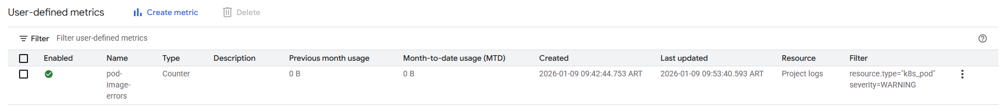
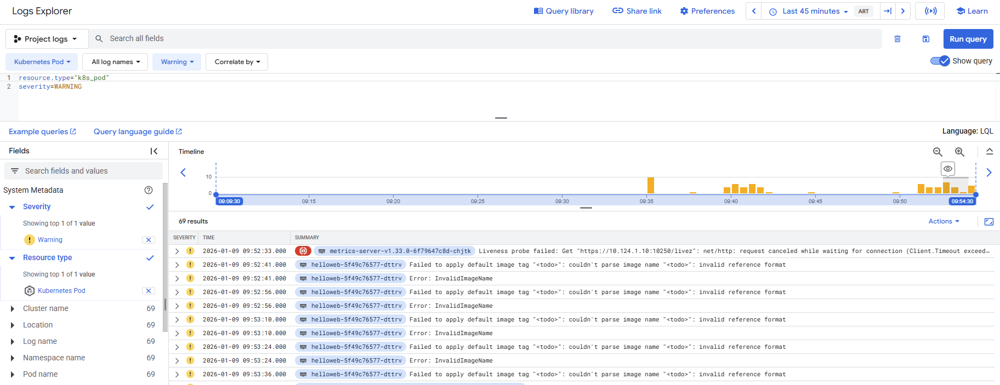

## Manage Kubernetes in Google Cloud: Challenge Lab

[Link](https://www.skills.google/course_templates/783/labs/612117)

## 📁 Kubernetes / Manage Kubernetes in Google Cloud

This section contains resources related to the "Manage Kubernetes in Google Cloud" skill badge. It demonstrates the ability to manage containerized applications at scale.

- Registry Management: Workflows for building and tagging images (v1 to v2) within Artifact Registry.

- GKE Deployment: Kubernetes manifests for deploying applications to Google Kubernetes Engine.

- Observability: Implementation of custom log-based metrics to track specific pod errors like "InvalidImageName".

Troubleshooting: Real-world fixes for Docker build context issues and Go compilation errors.

---------------------------------------

### Objective:

- 1) Creating a GKE cluster based on a set of configurations provided.
- 2) Enabling Managed Prometheus on the cluster for metrics monitoring.
- 3) Deploying a Kubernetes manifest onto the cluster, and debugging the errors.
- 4) Creating a logs-based metric and alerting policy for the errors on the Kubernetes cluster.
- 5) Fixing the manifest errors, containerizing your application code and pushing it to Artifact Registry using Docker.
- 6) Exposing a service for your application on the cluster and verifying your updates.

#### 0) Set ENV variables

```
export PROJECT_ID="qwiklabs-gcp-01-2a656ff7b275"
export ZONE="europe-west1-c"
export CLUSTER_NAME="hello-world-l60d"
export NAMESPACE_NAME="gmp-2itw"
export REPO_NAME="hello-repo"
export LOAD_BALANCER_NAME="helloweb-service-kseb"
export REGION="europe-west1"
```


Authenticate:
```bash
gcloud auth login
gcloud config set project ${PROJECT_ID}
```


#### 1) Creating the cluster

Create cluster and enable Prometheus
```bash
# Enable API
gcloud services enable container.googleapis.com

# Optional, get available version in the Zone.
gcloud container get-server-config --zone ${ZONE}

# Create the cluster, let Google asign the version
gcloud container clusters create ${CLUSTER_NAME} \
  --zone ${ZONE} \
  --release-channel regular \
  --num-nodes 3 \
  --enable-autoscaling \
  --min-nodes 2 \
  --max-nodes 6

# Verify the cluster
gcloud container clusters describe ${CLUSTER_NAME} --zone ${ZONE}
```

#### 2) Deploying a Kubernetes manifest onto the cluster, and debugging the errors

```bash
# Enable Prometheus
gcloud container clusters update ${CLUSTER_NAME} \
  --zone ${ZONE} \
  --enable-managed-prometheus

# Create the namespace
kubectl create ns ${NAMESPACE_NAME}
```

```bash
# Get the deployment file and fix it before applying:
gsutil cp gs://spls/gsp510/prometheus-app.yaml .
```


```bash
kubectl apply -f prometheus-app.yaml -n ${NAMESPACE_NAME}
```

Download the other deployment:
```bash
gsutil cp gs://spls/gsp510/pod-monitoring.yaml .
```


```bash
kubectl apply -f pod-monitoring.yaml -n ${NAMESPACE_NAME}
```

#### 3) Deploying a Kubernetes manifest onto the cluster, and debugging the errors.

```bash
gsutil cp -r gs://spls/gsp510/hello-app/ .

cd hello-app/
kubectl apply -f manifests/helloweb-deployment.yaml -n ${NAMESPACE_NAME}
```

Before fixing this, first create the logs-based metrics:

```bash
# Enable logging
gcloud services enable logging.googleapis.com

#Log-based metric creation
gcloud logging metrics create pod-image-errors \
    --log-filter='resource.type="k8s_pod" severity=WARNING'


# Make sure the filter content matches the following, or it will fail:
resource.type="k8s_pod"
severity=WARNING

# Verification
gcloud logging metrics list --filter="name:pod-image-errors"
```


```bash
# Verification
gcloud monitoring policies list --filter="displayName='Pod Error Alert'"
```

Check the Log Explorer to see if the log-based metric is running fine:





Now finish the fixing by setting the deployment image to: us-docker.pkg.dev/google-samples/containers/gke/hello-app:1.0


```bash
# Delete the deployment
kubectl delete deployment/helloweb -n ${NAMESPACE_NAME}

# Fix the image name
nano helloweb-deployment.yaml

# Deploy the new one
kubectl apply -f helloweb-deployment.yaml -n ${NAMESPACE_NAME}
```

#### 6) Containerize your code and deploy it onto the cluster

```bash
# Authenticate docker to Artifact Registry 
gcloud auth configure-docker ${REGION}-docker.pkg.dev


# Build the image with the given tag
docker build -t ${REGION}-docker.pkg.dev/${PROJECT_ID}/${REPO_NAME}/hello-app:v2 .
docker build -t us-east4-docker.pkg.dev/$PROJECT_ID/sandbox-repo/hello-app:v2 .


docker push ${REGION}-docker.pkg.dev/${PROJECT_ID}/${REPO_NAME}/hello-app:v2
docker push us-east4-docker.pkg.dev/$PROJECT_ID/sandbox-repo/hello-app:v2

# Update the deployment
kubectl set image deployment/helloweb \
    helloweb=$REGION-docker.pkg.dev/$PROJECT_ID/$REPO_NAME/hello-app:v2

# Get the image name
echo "${REGION}-docker.pkg.dev/${PROJECT_ID}/${REPO_NAME}/hello-app:v2"

# Image name >> Deployment
europe-west1-docker.pkg.dev/qwiklabs-gcp-01-2a656ff7b275/hello-repo/hello-app:v2

# Set the image (Do not do it other way, because the automatic checking fails)
k set image deployment helloweb hello-app=europe-west1-docker.pkg.dev/qwiklabs-gcp-01-2a656ff7b275/hello-repo/hello-app:v2

# Create the LB
kubectl -n $NAMESPACE_NAME expose deployment helloweb \
  --name=${LOAD_BALANCER_NAME} \
  --type=LoadBalancer \
  --port=8080 \
  --target-port=8080

kubectl get svc -n gmp-2itw                                                                                                                                                       cs-136552861682-default: Fri Jan  9 13:07:53 2026

NAME                    TYPE           CLUSTER-IP       EXTERNAL-IP     PORT(S)          AGE
helloweb-service-kseb   LoadBalancer   34.118.230.159   34.52.215.205   8080:30760/TCP   91s


# Test From local machine
curl http://34.52.215.205:8080/

StatusCode        : 200
StatusDescription : OK
Content           : Hello, world!
                    Version: 2.0.0
                    Hostname: helloweb-747cb4d749-k8qqf
```

